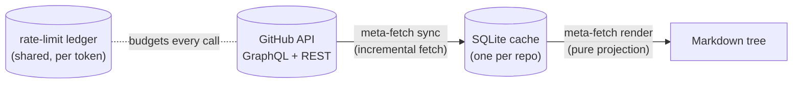

# github-repo-meta-fetch

[](https://github.com/demosdemon/github-repo-meta-fetch/actions/workflows/ci.yml)

`meta-fetch` incrementally syncs a GitHub repository's issues and pull requests into a local SQLite cache, then projects that cache into a **deterministic Markdown tree**: one file per issue and per PR, plus label/milestone/state indexes and a parent/sub-issue hierarchy overview.

The tree is built for offline consumption by AI coding agents (and humans). Instead of paging a rate-limited API mid-review, an agent can `grep` and read plain files: "every open issue labeled `bug`", "the review threads on PR 42", "which issues block #17" — all answerable without a network call or a token.



> [!NOTE]
> The Markdown tree is pure derived data — re-rendering from the same cache is byte-identical. It is safe to commit to git, and its diffs show exactly what changed upstream since the last sync.

## Install

```bash
cargo install --locked --git https://github.com/demosdemon/github-repo-meta-fetch.git
```

## Quick start

```bash
export GITHUB_TOKEN=…                       # optional — falls back to `gh auth token`

meta-fetch sync octocat/hello-world         # fetch what changed, render ./hello-world-meta/
meta-fetch sync octocat/hello-world --full  # walk everything; reconcile deletions
meta-fetch render octocat/hello-world       # re-project from the cache — no network
meta-fetch status octocat/hello-world       # watermarks, phases, entity counts
```

## The output tree

```text
hello-world-meta/
├── README.md          # entity counts + sync watermarks
├── CLAUDE.md          # schema guide: how to read and walk this tree
├── labels.md          # every label: color, description, usage count
├── milestones.md      # every milestone: state, due date, open/closed counts
├── hierarchy.md       # parent/sub-issue tree
├── issues/
│   ├── 0001.md …      # one file per issue, zero-padded
│   ├── by-label/      # index table per label
│   ├── by-milestone/  # index table per milestone
│   └── by-state/      # open.md, closed.md
└── prs/
    ├── 0042.md …      # one file per pull request
    ├── by-label/
    ├── by-milestone/
    └── by-state/      # open.md, draft.md, closed.md, merged.md
```

`CLAUDE.md` makes the tree self-describing: it documents the frontmatter schemas, the index table shapes, the filename and slug rules, and the traps worth knowing — most importantly that issues, pull requests, and GitHub Discussions share one number sequence, so a missing `issues/0037.md` can mean `#37` is a pull request, a discussion (which this tool never syncs), or genuinely deleted, not automatically a deleted issue. Tests assert every documented fact still matches what the renderer emits. A `CLAUDE.md` that meta-fetch did not generate is never overwritten.

Each issue file carries queryable YAML frontmatter — state, labels, assignees, milestone, timestamps, and relationship edges (parent, sub-issues, blocked-by, blocking, cross-referenced items) — followed by the body and the full comment thread:

```markdown
---
number: 42
title: "Bug"
state: open
state_reason: null
labels: ["bug"]
assignees: []
milestone: null
author: "octocat"
created_at: 2026-01-05T00:00:00Z
updated_at: 2026-06-10T00:00:00Z
closed_at: null
related: []
parent: null
sub_issues: []
blocked: 0
blocked_by: []
blocking: []
url: "https://github.com/octocat/hello-world/issues/42"
---

# #42 — Bug

Something is broken.

## Comments (1)

### hubot · 2026-01-06T00:00:00Z
Thanks for the report.
```

PR files add base/head refs, diff stats, who merged it, the issues the PR closes, review verdicts, and every review thread with its diff hunk and resolution state:

````markdown
## Reviews (1)

### demosdemon · APPROVED · 2026-06-14T00:00:00Z
LGTM

## Review threads (1)

### src/sync/mod.rs:88 · resolved
```diff
@@ -85,3 +85,4 @@
-old
+new
```

**demosdemon · 2026-06-11T00:00:00Z:** pass the query type
````

`hierarchy.md` renders the repo-wide parent/sub-issue tree (to GitHub's nesting limit of eight levels); sub-issues living in other repositories appear as plain text marked *external*.

### Determinism

- Re-rendering from an unchanged cache reproduces the tree **byte for byte** (asserted by an integration test).
- Filenames are zero-padded to a width that never shrinks — 4 digits from the first render, 5 once the repo passes 9,999 issues, and so on. Removing the highest-numbered item never renumbers anything, but a number gaining a digit renames every file in the tree at once.
- Index directories are fully derived: wiped and rebuilt on every render. Files for deleted items are pruned.

## Incremental sync

`sync` is designed to be cheap to run often and safe to interrupt at any point:

- Each phase (issues, PRs) pages `updatedAt` descending and **stops early** at the previous run's watermark — cost scales with how much changed, not with repository size.
- Every item (with all of its comment, review, and relationship pages drained) is persisted in its own transaction, and the page cursor is checkpointed after every page. Kill the process mid-run — Ctrl-C, crash, rate-limit pause — and the next run resumes from the checkpoint.
- The watermark only advances when a phase completes cleanly, so an interrupted run can never miss an update.
- Labels and milestones are fetched with REST conditional requests; when nothing changed, GitHub answers `304 Not Modified` and the cached rows are left untouched.

One known window: a relationship edge (parent, sub-issue, blocked-by) can reference a same-repo issue that hasn't been synced yet, in which case its link in `hierarchy.md` or the frontmatter points at a file that doesn't exist yet. The link self-heals on the next sync that reaches the target issue.

Deletion is the one thing an incremental pass cannot see (a deleted issue no longer appears in any page). `--full` walks the entire repository and soft-deletes cached items that no longer exist upstream; their rendered files are pruned on the next render. Reconciliation runs only on a *fresh* full pass — if a `--full` run pauses at the rate-limit floor, the resumed run finishes the remaining pages but skips deletion reconciliation (it has an incomplete picture of what still exists); run `--full` again for that.

## Rate-limit awareness

`meta-fetch` treats your GraphQL point budget as a first-class resource:

- Every response's `X-RateLimit-*` headers feed a per-bucket budget tracker, and an [EWMA](https://en.wikipedia.org/wiki/Exponential_smoothing) estimator per query type predicts what the *next* call will cost before making it.
- Budgets live in a SQLite ledger **shared across processes and keyed by a SHA-256 fingerprint of the token**, so concurrent syncs using the same token reserve points atomically instead of independently racing past the limit.
- `--reserve` keeps a floor of your quota untouched for other tools sharing the token (default `10%`; also accepts an absolute point count like `500`).

On reaching the reserve floor, `sync` either sleeps until the quota resets (capped by `--max-wait`) or, with `--no-wait`, checkpoints and exits with code **75** (`EX_TEMPFAIL`, the sysexits code for a temporary failure that is safe to retry), making unattended runs easy to schedule:

```bash
# cron-friendly: never blocks; resumes from the checkpoint on the next tick
meta-fetch sync octocat/hello-world --no-wait
```

## Command reference

### `meta-fetch sync <owner/repo>`

Incremental fetch + render.

| Flag | Default | Effect |
| :--- | :--- | :--- |
| `--out DIR` | `./<repo>-meta` | Output directory for the Markdown tree |
| `--db PATH` | per-repo data dir | Override the cache location |
| `--full` | off | Walk everything; reconcile deletions |
| `--only <issues\|prs>` | all phases | Restrict to one entity phase (repeatable) |
| `--reserve <N\|N%>` | `10%` | Quota floor left untouched for other tools |
| `--max-wait DUR` | unbounded | Cap a rate-limit sleep (e.g. `45m`) |
| `--no-wait` | off | Exit `75` at the floor instead of sleeping |
| `--cost-ceiling N` | per-query defaults | Override the assumed worst-case cost per call |

### `meta-fetch render [owner/repo]`

Re-project the Markdown tree from the local cache — no network, no token. Accepts `--db` and `--out` as above; give either the repo slug or `--db`.

### `meta-fetch status [owner/repo]`

Print watermarks, in-progress phase checkpoints, relationship edge counts, and per-state entity counts for the cached repo.

## Authentication

A token is resolved from `$GITHUB_TOKEN` first, then from `gh auth token` if the [GitHub CLI](https://cli.github.com/) is logged in. The resolved token needs read access to the target repository's issues and pull requests.

## Where data lives

| What | Unix (Linux & macOS) | Windows |
| :--- | :--- | :--- |
| Repo cache | `$XDG_DATA_HOME/github-repo-meta-fetch/{owner}/{repo}.sqlite3` | `%APPDATA%\leblanc\github-repo-meta-fetch\data\{owner}\{repo}.sqlite3` |
| Rate-limit ledger | `$XDG_STATE_HOME/github-repo-meta-fetch/rate-limits.sqlite3` | `%APPDATA%\leblanc\github-repo-meta-fetch\data\rate-limits.sqlite3` |

The Markdown tree goes wherever you point `--out` (default: `./<repo>-meta` in the current directory).

## Development

```bash
just test    # cargo test
just lint    # clippy, pedantic, warnings denied
just fmt     # rustfmt (nightly options)
```

MSRV is **1.96**. Render output is covered by [insta](https://insta.rs/) snapshots (`cargo insta review` after intentional changes), and a determinism test byte-compares two full renders.

## License

[MIT](LICENSE)
